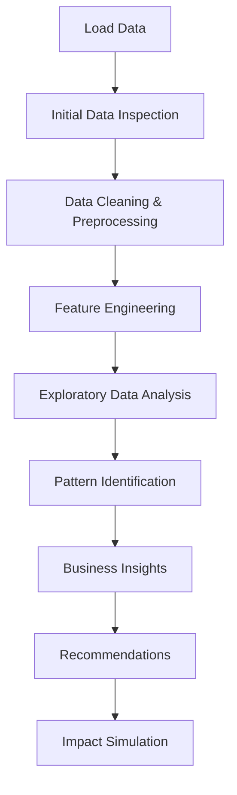

# Coffee Shop Sales Analysis 
## Strategic Revenue Optimization Project

[](https://github.com/yourusername/coffee-shop-analysis)
[](https://www.microsoft.com/excel)
[](https://github.com/yourusername/coffee-shop-analysis)

---

## 📋 Table of Contents
1. [Executive Summary](#executive-summary)
2. [Project Overview](#project-overview)
3. [Technical Implementation](#technical-implementation)
4. [Key Findings](#key-findings)
5. [Business Impact & Recommendations](#business-impact--recommendations)
6. [Setup & Reproducibility](#setup--reproducibility)
7. [Future Enhancements](#future-enhancements)
8. [Lessons Learned](#lessons-learned)

---

## 🎯 Executive Summary

### Business Challenge
**"What strategies can we implement to drive total revenue growth across all branches in the upcoming quarter?"**

### Solution Overview
Through comprehensive analysis of coffee shop sales data, we identified strategic opportunities to increase quarterly revenue by **7.6%** (~$29,628) through targeted interventions during peak hours and underperforming time periods.

### Key Success Metrics
- **Primary Goal**: Increase total revenue in the next quarter
- **Stakeholder**: Coffee Shop Owner
- **Success Criteria**: Measurable revenue growth through data-driven recommendations

### Strategic Recommendations Summary
1. **Morning Power Combo** - Bundle strategy for peak hours (8-10 AM)
2. **Afternoon Delight Program** - Traffic generation during slow periods (2-5 PM)  
3. **Weekend Relaxation Offer** - Family/group targeting for weekend revenue recovery

---

## 🏢 Project Overview

### Business Context
This analysis was conducted to address declining growth concerns and identify untapped revenue opportunities across multiple coffee shop locations. The project focuses on understanding customer behavior patterns, peak performance periods, and product category performance.

### Stakeholder Information
- **Primary Stakeholder**: Coffee Shop Owner
- **Secondary Stakeholders**: Store managers, marketing team
- **Decision Timeline**: Implementation planned for next quarter

### Success Definition
- Quantifiable increase in total revenue
- Improved customer transaction values
- Better utilization of slow periods
- Enhanced product mix optimization

---

## 🔧 Technical Implementation

### Data Sources
- **Primary Dataset**: [Coffee Sales Dataset](https://www.kaggle.com/datasets/ahmedabbas757/coffee-sales)
- **Data Period**: February - June (5 months)
- **Records**: Comprehensive transaction-level data
- **Geographic Scope**: Multiple coffee shop locations

### Technology Stack
- **Primary Tool**: Microsoft Excel
- **Analysis Techniques**: Pivot tables, statistical functions, trend analysis
- **Visualization**: Excel charts and conditional formatting

### Methodology Workflow



#### 1. Data Loading & Inspection
- Imported raw CSV data into Excel
- Verified data completeness and structure
- Identified key columns: transaction_date, transaction_time, transaction_qty, unit_price, product_category

#### 2. Data Cleaning & Preprocessing
- **DateTime Conversion**: Transformed transaction_date and transaction_time to proper Excel datetime format
- **Revenue Calculation**: Created revenue column using formula: `=transaction_qty * unit_price`
- **Data Validation**: Checked for null values, duplicates, and outliers

#### 3. Feature Engineering
Created derived columns for temporal analysis:
- **Hour**: `=HOUR(transaction_time)` - for hourly pattern analysis
- **Day of Week**: `=WEEKDAY(transaction_date,2)` - for weekly patterns  
- **Month**: `=MONTH(transaction_date)` - for seasonal trends
- **Revenue per Transaction**: For average transaction value analysis

#### 4. Exploratory Data Analysis (EDA)
Systematic analysis using Excel pivot tables:
- Revenue trends by month
- Category performance analysis  
- Hourly sales patterns
- Weekly distribution patterns
- Product mix analysis

---

## 📊 Key Findings

### 🚀 1. Strong Growth Momentum
**Observation**: Significant revenue increase from February to June
- **Data Point**: Consistent month-over-month growth
- **Business Implication**: Company is in healthy growth phase
- **Confidence Level**: High (based on 5-month trend data)

### 👑 2. Coffee & Tea Dominance  
**Observation**: Two categories drive majority of revenue
- **Data Point**: >59% of total revenue from Coffee & Tea
- **Supporting Category**: Bakery as strongest complementary category
- **Strategic Insight**: Focus resources on these high-performing categories

### ☀️3. Morning Rush Peak Performance
**Observation**: Dramatic sales spike 8-10 AM
- **Data Point**: Peak traffic driven by commuter customers
- **Opportunity**: High-volume, time-constrained customers ideal for upselling
- **Customer Profile**: Working professionals seeking quick service

### 📉 4. Weekend Performance Gap
**Observation**: Sales decline on Saturday and Sunday  
- **Data Point**: Lower weekend traffic
- **Customer Insight**: Primary customer base appears to be office workers
- **Opportunity**: Untapped weekend market potential

---

## 💼 Business Impact & Recommendations

### Recommendation #1: Morning Power Combo
**Objective**: Increase average transaction value during peak hours

**Strategy**: 
- Bundle coffee/tea with bakery items at special pricing
- Target 8-10 AM rush hour customers
- Capitalize on time-pressed commuters

**Implementation**:
- Create "Grab & Go" combo pricing
- Train staff for quick upsell techniques
- Position bakery items prominently during morning hours

**Financial Impact Simulation**:
- **Assumption**: 15% of morning beverage customers add bakery item
- **Monthly Additional Revenue**: ~$9,876
- **Quarterly Impact**: ~$29,628
- **Total Revenue Increase**: +7.6% per quarter

### Recommendation #2: Afternoon Delight Program
**Objective**: Increase traffic during slow periods (2-5 PM)

**Strategy**:
- Implement afternoon-specific discounts
- Target non-peak hours with promotional pricing
- Create "3 PM Pick-Me-Up" campaigns

**Expected Outcomes**:
- Improved afternoon sales volume
- Better staff utilization during slow periods
- Enhanced customer acquisition

### Recommendation #3: Weekend Relaxation Offer
**Objective**: Capture weekend family/group market

**Strategy**:
- Develop family-friendly packages
- Create group discounts for weekend visits
- Market relaxed atmosphere vs. weekday efficiency

**Target Segments**:
- Families with children
- Friend groups seeking social spaces
- Leisure-focused customers

---

## 🛠️ Setup & Reproducibility

### Prerequisites
- Microsoft Excel 2016 or later
- Basic knowledge of pivot tables and Excel formulas
- Access to the source dataset

### File Structure
```
coffee-shop-analysis/
├── data/
│   ├── raw/
│   │   └── coffee_sales.csv
│   └── processed/
│       └── coffee_sales_cleaned.xlsx
├── analysis/
│   ├── Coffee_Shop_Analysis.xlsx
│   └── pivot_tables/
├── visualizations/
│   ├── revenue_trends.png
│   ├── category_breakdown.png
│   └── hourly_patterns.png
├── reports/
│   ├── executive_summary.pdf
│   └── technical_report.pdf
└── README.md
```

### Reproduction Steps
1. **Data Preparation**
   ```excel
   1. Download dataset from Kaggle link
   2. Open Excel, import CSV file
   3. Create new columns for derived features:
      - Revenue: =D2*E2 (qty * price)
      - Hour: =HOUR(C2)
      - DayOfWeek: =WEEKDAY(B2,2)
      - Month: =MONTH(B2)
   ```

2. **Analysis Execution**
   ```excel
   1. Create pivot table for monthly trends
   2. Analyze category performance
   3. Build hourly sales pattern analysis
   4. Calculate weekend vs weekday performance
   5. Generate impact simulations
   ```

3. **Validation Steps**
   - Verify all formulas return expected results
   - Cross-check pivot table calculations
   - Validate date/time conversions
   - Confirm revenue calculations match source data

### Dependencies
- **Software**: Microsoft Excel (365, 2019, or 2016)
- **Add-ins**: Analysis ToolPak (for advanced statistical functions)
- **System Requirements**: Windows 10/11 or macOS 10.14+

---

## 🚀 Future Enhancement Opportunities

### Phase 2 Development Roadmap

#### Advanced Analytics Implementation
1. **Customer Segmentation Analysis**
   - RFM analysis (Recency, Frequency, Monetary)
   - Customer lifetime value calculations
   - Behavioral clustering

2. **Predictive Modeling**
   - Sales forecasting models
   - Demand prediction by product category
   - Seasonal adjustment algorithms

3. **A/B Testing Framework**
   - Systematic testing of recommendations
   - Control group analysis
   - Statistical significance validation

#### Technical Upgrades
1. **Tool Migration**
   - Transition from Excel to Python/R for scalability
   - Implementation of automated data pipelines
   - Real-time dashboard development

2. **Data Enrichment**
   - Integration with POS system data
   - Weather data correlation analysis
   - Competitive analysis inclusion

3. **Advanced Visualization**
   - Interactive Tableau/Power BI dashboards
   - Mobile-responsive reporting
   - Real-time performance monitoring

#### Business Intelligence Expansion
1. **Multi-Location Analysis**
   - Cross-store performance comparison
   - Location-specific optimization strategies
   - Regional trend identification

2. **Inventory Optimization**
   - Product mix optimization
   - Waste reduction analysis
   - Supply chain efficiency improvement

---

## 📚 Lessons Learned

### Technical Insights
1. **Excel Limitations**: While Excel provided sufficient functionality for initial analysis, scaling to larger datasets or more complex analyses would benefit from programming languages like Python or R.

2. **Data Quality Importance**: Initial data cleaning revealed several inconsistencies that required manual intervention, highlighting the need for robust data validation processes.

3. **Feature Engineering Value**: Creating derived time-based features (hour, day of week, month) was crucial for uncovering temporal patterns that directly informed business recommendations.

### Business Intelligence Discoveries
1. **Simplicity Wins**: The most impactful recommendations were often the simplest to implement, such as strategic product bundling during peak hours.

2. **Timing is Everything**: Understanding when customers shop proved more valuable than just understanding what they buy.

3. **Incremental Improvements**: Small percentage improvements in average transaction value can compound to significant revenue increases over time.

### Stakeholder Communication
1. **Visual Impact**: Charts and graphs were essential for communicating findings to non-technical stakeholders.

2. **Financial Translation**: Converting analytical insights into concrete financial impact projections was crucial for gaining buy-in.

3. **Actionable Recommendations**: Stakeholders valued specific, implementable strategies over abstract analytical observations.

### Project Management Insights
1. **Iterative Approach**: Breaking analysis into phases (EDA → Insights → Recommendations → Impact Simulation) provided better structure and allowed for course corrections.

2. **Documentation Importance**: Maintaining detailed documentation throughout the analysis process enabled better reproducibility and stakeholder communication.

3. **Assumption Validation**: Clearly documenting assumptions used in impact calculations helped build credibility with business stakeholders.

---

## 📖 Citations & References

### Data Sources
- **Primary Dataset**: Abbas, A. (2023). Coffee Sales Dataset. Kaggle. Retrieved from https://www.kaggle.com/datasets/ahmedabbas757/coffee-sales

### Methodology References
- Microsoft Excel Data Analysis Best Practices
- Business Intelligence and Analytics: Systems for Decision Support (Sharda, Delen, & Turban, 2020)
- Retail Analytics Methodologies and Applications

### Tools & Software
- Microsoft Excel 365 for data analysis and visualization
- Excel Analysis ToolPak for statistical functions

---

## 🤝 Contributing & Contact

### Project Team
- **Lead Analyst**: Naufal Iffa M R
- **Business Stakeholder**: Coffee Shop Owner
- **Project Timeline**: 25/08/2025 - 01/09/2025

### Repository Information
- **GitHub Repository**: ` `
- **License**: MIT License
- **Last Updated**: [Current Date]

### Contact Information
For questions about this analysis or collaboration opportunities:
- **Email**: your.email@example.com
- **LinkedIn**: 
- **Project Issues**: Use GitHub Issues for technical questions

---

## 📄 License
This project is licensed under the MIT License - see the [LICENSE](LICENSE) file for details.

---

*This analysis was conducted as part of a strategic business intelligence initiative to optimize coffee shop revenue through data-driven insights and recommendations.*
